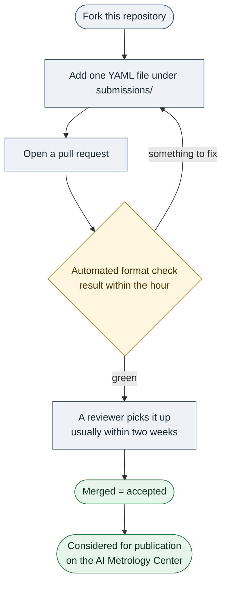

# NIST AI Metrology Center - Community Submissions

This repository is the public intake point for **community submissions of AI metrics and
measurement methodologies** proposed for inclusion in the NIST AI Metrology Center:
<https://airc.nist.gov/metrology/>.

A submission is a GitHub **pull request** adding one YAML file that describes one metric
or measurement method. Review happens in the open, on the pull request; an accepted
(merged) submission is considered for publication on the AI Metrology Center.

> [!IMPORTANT]
> **This is a new process.** We are standing up community submissions for the first time,
> and we expect to refine it as we go: the submission format may evolve, guidance may be
> clarified, and response times may be uneven while we ramp up. Thank you for your
> patience — early submitters are helping us shape this.

## What's in scope

Metrics (quantitative or qualitative measures) **and** measurement methodologies
(benchmarks, red-teaming methods, evaluation procedures) for AI test, evaluation,
verification, and validation (TEVV) — the kinds of entries already published on the
[AI Metrology Center](https://airc.nist.gov/metrology/).

## How it works

## Submit a metric

1. Read the [submission guide](CONTRIBUTING.md) and the
   [submission format](SUBMISSION_FORMAT.md).
2. **Fork** this repository.
3. In your fork, add one file `submissions/<metric-name>.yml` following the format.
4. **Open a pull request.** Maintainers are notified automatically and will take it
   from there.

> [!TIP]
> **See it done first.** Two worked examples are kept open as pull requests, so you can
> read a complete submission and its review before writing your own — see the
> [example submissions](../../pulls?q=is%3Apr+label%3Aexample-submission).

> [!CAUTION]
> **Everything here is public.** Do not submit proprietary or confidential information.
> The submission file and all review discussion are publicly visible, and any content
> posted here is considered public disclosure and non-confidential.
## Questions or Feedback

Open an [issue](../../issues).
